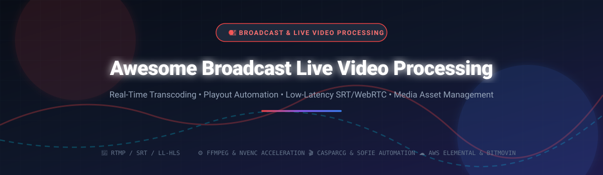

# Awesome-Broadcast-Live-Video-Processing

# Awesome-Broadcast-Live-Video-Processing 🎥 📡

  

  
  
  
  
  
  

---

## 🌟 Top Broadcast Live Video Processing Ecosystem

**Curated List of Commercial Live Encoding Platforms & Open-Source Broadcast Automation Tools**  
*Focused on Real-Time Transcoding, Playout Automation, Low-Latency Protocols, Media Asset Management & Self-Hosted Streaming Servers*  

**Last updated: October 2026** 📅

---

### 📌 Overview & SEO Summary
Welcome to the ultimate curated directory of **broadcast live video processing platforms**, **open-source playout automation systems**, and **real-time media transcoding frameworks**. Whether you are looking for enterprise-grade commercial solutions (such as *AWS Elemental MediaLive*, *Bitmovin*, and *Wowza*), or self-hostable open-source alternatives (like *CasparCG*, *Nebula*, and *Owncast*), this list covers category leaders, broadcast-grade playout engines, and privacy-respecting streaming infrastructure.

---

## 📑 Table of Contents
- [🏢 SaaS & Commercial Platforms](#-saas--commercial-platforms)
- [🔓 Open-Source GitHub Projects](#-open-source-github-projects)
- [🛠️ How to Contribute](#%EF%B8%8F-how-to-contribute)
- [📊 Star History](#-star-history)
- [🤝 Support & Sponsorship](#-support--sponsorship)
- [⚠️ Disclaimer](#%EF%B8%8F-disclaimer)

---

## 🏢 SaaS / Commercial Platforms

The broadcast live video processing market spans cloud-native encoding services and on-premises playout systems. Codec adoption is shifting: H.264 remains universal for general streaming, H.265/HEVC handles 4K and sports, AV1 delivers excellent compression for VOD and FAST channels, and VVC/H.266 is emerging for future 8K workflows [citation:2]. Cloud platforms offer elastic scaling while traditional vendors provide broadcast-grade reliability and integration with hardware switchers.

| SaaS / Commercial Platform | Company / Owner | Valuation / Market Cap | Standard Edition Starting Price | Free Tier / Free Trial Limits | Description |
| :--- | :--- | :--- | :--- | :--- | :--- |
| **[AWS Elemental MediaLive](https://aws.amazon.com/medialive/)** ☁️ | Amazon | ~$2.0 Trillion | Pay-as-you-go per input and output | **Free trial available** for AWS customers | **Cloud broadcast encoding** — Real-time video transcoding for broadcast and streaming. Supports H.264, H.265, and AV1. Integrates with MediaConnect, MediaPackage, and CloudFront. |
| **[Bitmovin Live Encoding](https://bitmovin.com/)** 🎬 | Bitmovin | Private | Custom per-GB or per-hour pricing | **Free trial available** | **Cloud-native video infrastructure** — Live and VOD encoding, player, and analytics. AV1 and VVC support. Per-title encoding optimization. |
| **[Wowza Video](https://www.wowza.com/)** 🎥 | Wowza Media Systems | Private | From $150/month (usage-based) | **Free trial available** | **Streaming platform for developers** — Live and VOD streaming with low-latency HLS, WebRTC, and SRT. Self-hosted or cloud deployment. |
| **[Harmonic VOS360](https://www.harmonicinc.com/)** 📡 | Harmonic Inc. | ~$1 Billion | Custom enterprise pricing | **Demo available** | **Cloud-native video delivery** — SaaS platform for live and VOD processing. Broadcast-grade reliability with elastic scaling. |
| **[LiveU Studio](https://www.liveu.tv/)** 🚀 | LiveU | Private | Custom enterprise pricing | **Demo available** | **Cloud production and remote contribution** — Live video acquisition, bonding, and cloud production. Used for news and sports remote production. |
| **[Brightcove Live](https://www.brightcove.com/)** 🌐 | Brightcove Inc. | ~$500 Million | Custom enterprise pricing | **Free trial available** | **Online video platform** — Live streaming, VOD, and monetization. Global CDN with adaptive bitrate delivery. |
| **[Telestream Vantage Cloud](https://www.telestream.net/)** 🎞️ | Telestream | Private | Custom enterprise pricing | **Demo available** | **Media processing and workflow automation** — Cloud-based transcoding, captioning, and packaging. Used in broadcast and media supply chains. |
| **[Grass Valley AMPP](https://www.grassvalley.com/)** 🏔️ | Grass Valley | Private | Custom enterprise pricing | **Demo available** | **Agile media processing platform** — Cloud-native live production, playout, and distribution. Software-defined broadcast infrastructure. |
| **[TVU Producer](https://www.tvunetworks.com/)** 📹 | TVU Networks | Private | Custom enterprise pricing | **Demo available** | **Cloud-based live production** — Remote production, switching, and distribution. Used for news and live events. |
| **[Qumu Cloud](https://qumu.com/)** 🏢 | Qumu (Enghouse) | Private | Custom enterprise pricing | **Demo available** | **Enterprise video platform** — Live streaming, video on demand, and enterprise content management. Focus on corporate communications. |

---

## 🔓 Open-Source GitHub Projects

*Sorted by GitHub_Stars_Count (Descending)* 🌟

- **[CasparCG Server](https://github.com/CasparCG/server)**   
  **Professional playout software for broadcast graphics, audio, and video**, GPL-3.0 licensed. **973 stars** [citation:13]. **In 24/7 broadcast production since 2006** [citation:13]. Windows and Linux support. Multiple output channels with SDI, NDI, and streaming outputs. AMCP protocol for automation control. Used by broadcasters worldwide for linear playout and live production [citation:8][citation:13]. 🎬

- **[Owncast](https://github.com/owncast/owncast)**   
  **Self-hosted live video streaming and chat server**, MIT licensed. **12k stars, 1k forks** [citation:17]. Single-user streaming platform for complete content ownership. **Compatible with any RTMP broadcasting software** (OBS, Streamlabs) [citation:3]. Built-in chat, admin interface, and embeddable player. Written in Go with React frontend. Docker deployment available [citation:3][citation:17]. 🏠

- **[MediaMTX](https://github.com/bluenviron/mediamtx)**   
  **Ready-to-use media server and proxy**, MIT licensed. **Protocol conversion** between SRT, WebRTC, RTSP, RTMP, HLS, and LL-HLS [citation:7]. Stream recording to fMP4 or MPEG-TS. Hot reloading without disconnecting clients. Prometheus metrics. JWT authentication. **Single executable with no dependencies** — runs on Linux, Windows, and macOS [citation:7]. 🔄

- **[Nebula](https://github.com/nebulabroadcast/nebula)**   
  **Broadcast automation and media asset management**, open-source. **In 24/7 production since 2012** [citation:18]. Python backend with React frontend. **EBU Core metadata standard** for media catalog. **Playout control for CasparCG** and custom plugins [citation:18]. Linear scheduling with drag-and-drop. **NVIDIA NVENC acceleration** for H.264 and HEVC transcoding [citation:18]. EBU R128 loudness normalization. Prometheus metrics and Grafana dashboards. Used by TV and production companies worldwide [citation:18]. 📺

- **[OpenBroadcaster](https://github.com/openbroadcaster)**   
  **Broadcast automation and emergency alerting**, AGPL-3.0 licensed. **OBServer: 185 stars; OBPlayer: 143 stars** [citation:4]. **GStreamer-based playout** for radio and TV automation [citation:4]. **CAP Emergency Alerting** for broadcast, LED signage, and CATV [citation:4]. Media asset management with API access. Plugin module architecture for extensibility. Used by community and multicultural broadcasters [citation:4]. 📻

- **[ffplayout](https://github.com/ffplayout/ffplayout)**   
  **Rust and FFmpeg based playout system**, GPL-3.0 licensed. **456 stars** [citation:8]. Web-based frontend available (152 stars). Designed for 24/7 linear broadcast playout. Uses FFmpeg for decoding and encoding. Simple configuration and deployment [citation:8]. 🦀

- **[Sofie TV Automation](https://github.com/Sofie-Automation/Sofie-TV-automation)**   
  **TV studio automation system**, MIT licensed. **310 stars** [citation:8][citation:13]. **Used in live TV news production by NRK (Norwegian public broadcaster) since 2018** [citation:13]. Modular architecture for newsroom automation. Integrates with CasparCG for playout [citation:13]. 📰

- **[CasparCG media-scanner](https://github.com/CasparCG/media-scanner)**   
  **Media scanning service for CasparCG**, open-source. **32 stars** [citation:13]. Scans media files on server and provides query/thumbnail commands through AMCP protocol. TypeScript implementation. Essential companion for CasparCG deployments [citation:13]. 🔍

- **[Open Source FAST Channel Engine](https://github.com/...)**   
  **VOD2Live FAST channel library**, open-source. **109 stars** [citation:8]. Converts VOD content into live FAST channels. Part of the open-source streaming ecosystem for broadcast [citation:8]. 📡

- **[SRT Live Server](https://github.com/...)**   
  **Low-latency SRT streaming server**, open-source. **644 stars** [citation:8]. SRT protocol support for broadcast contribution. Relay server for distributing media streams to multiple clients (138 stars) [citation:8]. 🚀

- **[datarhei Core](https://github.com/datarhei/core)**   
  **FFmpeg process management**, open-source. **187 stars** [citation:8]. **Management for FFmpeg processes without development effort** [citation:8]. REST API for controlling FFmpeg instances. Whether your streaming has one viewer or a million, datarhei Core handles the orchestration [citation:8]. ⚙️

- **[CasparCG Client (t4Playout)](https://github.com/mekhti/t4Playout)**   
  **TV playout automation frontend for CasparCG**, open-source. **2 stars** [citation:13]. Python-based client for controlling CasparCG Server. Simple interface for linear playout automation [citation:13]. 🎛️

- **[Constatus](https://github.com/folkertvanheusden/constatus)**   
  **Video streaming and processing application**, open-source. **NVR with special features** [citation:14]. Inputs: V4L2, MJPEG, RTSP, JPEG cameras, VNC, GStreamer, PipeWire, libcamera. Outputs: AVI, JPEGs, HTTP streaming (MJPEG, OGG), V4L2 loopback, VNC server. **Motion detection and audio detection** for automated recording [citation:14]. Filters: text overlay, contrast boost, grayscale, mirror, scaling, picture overlay. Web interface with PAM authentication. REST API [citation:14]. 🎥

---

## 🛠️ How to Contribute

Contributions are welcome! Follow these steps to submit new broadcast video processing platforms or open-source streaming software:

1. 🍴 **Fork** the repository.
2. 📝 **Add/edit** entries in `README.md` maintaining table/list structure and formatting.
3. 🔗 Include project title, official website/GitHub link, exact Stars_Count, license, and brief description.
4. 🚀 Submit a **Pull Request** with a descriptive summary of your changes.

---

## 📊 Star History

---

## 🤝 Support & Sponsorship

If you find this broadcast live video processing repository useful, please consider supporting the project:

- ⭐ **Star** this repository to increase visibility!
- 🔀 **Fork** and share with fellow broadcast engineers, streaming developers, and open-source advocates.
- ☕ **Sponsor & Buy Me a Coffee**: Support ongoing open-source curation via the [GitHub Sponsor Dashboard](https://github.com/sponsors/ishandutta2007).

---

## ⚠️ Disclaimer

- This is a **community-curated** list — not exhaustive and not an endorsement. ℹ️
- Broadcast playout systems operate in **mission-critical 24/7 environments**. **Always test failover, redundancy, and disaster recovery procedures** before deploying to production. CasparCG and Nebula have proven reliability in broadcast environments since 2006 and 2012 respectively [citation:13][citation:18], but require proper operational discipline.
- Open-source broadcast tools (CasparCG, Nebula, Owncast) provide self-hosted ownership and transparency, but enterprise-grade SLA guarantees, 24/7 vendor support, and hardware integration certification remain primarily commercial offerings. Codec selection matters: H.264 for universal compatibility, H.265 for 4K, AV1 for bandwidth efficiency, and VVC for future 8K workflows [citation:2]. 🎥

---

  <b>Made with ❤️ for broadcast engineers, streaming developers, and open-source media advocates.</b>

